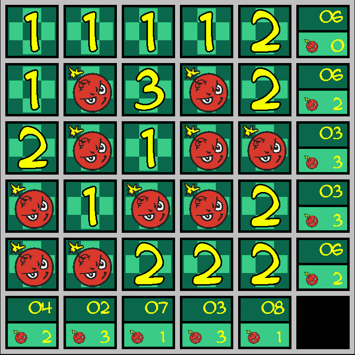

<!-- Improved compatibility of back to top link: See: https://github.com/othneildrew/Best-README-Template/pull/73 -->
<a name="readme-top"></a>
<!--
*** Thanks for checking out the Best-README-Template. If you have a suggestion
*** that would make this better, please fork the repo and create a pull request
*** or simply open an issue with the tag "enhancement".
*** Don't forget to give the project a star!
*** Thanks again! Now go create something AMAZING! :D
-->


<!-- PROJECT SHIELDS -->
<!--
*** I'm using markdown "reference style" links for readability.
*** Reference links are enclosed in brackets [ ] instead of parentheses ( ).
*** See the bottom of this document for the declaration of the reference variables
*** for contributors-url, forks-url, etc. This is an optional, concise syntax you may use.
*** https://www.markdownguide.org/basic-syntax/#reference-style-links
-->


<!-- PROJECT LOGO -->
<br />
<div align="center">
  <a href="https://github.com/TrainerFromHoenn/flip">
    
  </a>

<h3 align="center">BOMB_FLIP</h3>

  <p align="center">
    Versione giocabile su PC del minigioco Voltorb Flip (https://bulbapedia.bulbagarden.net/wiki/Voltorb_Flip).
    <br />
    <a href="https://github.com/TrainerFromHoenn/flip"><strong>Explore the docs »</strong></a>
    <br />
    <br />
    <a href="https://github.com/TrainerFromHoenn/flip/issues">Report Bug</a>
    ·
    <a href="https://github.com/TrainerFromHoenn/flip/issues">Request Feature</a>
  </p>
</div>


<!-- TABLE OF CONTENTS -->
<details>
  <summary>Table of Contents</summary>
  <ol>
    <li>
      <a href="#about-the-project">About The Project</a>
      <ul>
        <li><a href="#built-with">Built With</a></li>
      </ul>
    </li>
    <li>
      <a href="#getting-started">Getting Started</a>
      <ul>
        <li><a href="#prerequisites">Prerequisites</a></li>
        <li><a href="#installation">Installation</a></li>
      </ul>
    </li>
  </ol>
</details>


<!-- ABOUT THE PROJECT -->
## About The Project

<p align="right">(<a href="#readme-top">back to top</a>)</p>


### Built With

* [![Haskell][Haskell.org][Haskell-url]]
* [![Gloss][hackage.haskell.org/package/gloss][gloss-url]]

<p align="right">(<a href="#readme-top">back to top</a>)</p>


<!-- GETTING STARTED -->
## Getting Started

To get a local copy up and running follow these simple example steps.

### Prerequisites

Install stack on your computer:
https://docs.haskellstack.org/en/stable/README/

### Installation

1. Clone the repo
   ```sh
   git clone https://github.com/TrainerFromHoenn/flip.git
   ```
3. Build it with stack
   ```sh
   cd .\flip\
   stack setup
   stack build
   ```
4. Execute 
   ```sh
   stack run
   ```

<p align="right">(<a href="#readme-top">back to top</a>)</p>


<!-- USAGE EXAMPLES -->
## Usage

1. Select the difficulty level from 1 to 7 -> A wrong input will crash the executable
   ```sh
   Inserisci livello di difficoltà 1 - 7
   5
   ```
2. Il tabellone è composto da 25 caselle coperte. Il contenuto delle caselle può essere
   un numero da 1 a 3, oppure una bomba. Lo scopo del gioco è girare tutte le caselle
   contenenti i numeri 2 e 3. Ai lati del tabellone è possibile sapere quante bombe sono 
   presenti in una determinata riga o colonna, e la somma dei numeri presenti. 

3. Premi barra spaziatrice per girare una casella. Se la casella contiene una bomba: Game Over

4. E' possibile prendere nota sulle caselle ancora non girate di quale può essere il contenuto. 
   Per farlo basta premere x sulla tastiera per entrare in modalità note. 
   I tasti 1, 2 e 3 della tastiera permetteranno di annotare i numeri, mentre il tasto 0 le bombe.
   Premere x nuovamente farà uscire dalla modalità note (non è possibile girare caselle in modalità note)

5. Una volta concluso il gioco, premendo barra spaziatrice è possibile vedere la soluzione


<p align="right">(<a href="#readme-top">back to top</a>)</p>


<!-- CONTACT -->
## Contact

Your Name - michelebiena@gmail.com

Project Link: [https://github.com/TrainerFromHoenn/flip](https://github.com/TrainerFromHoenn/flip)

<p align="right">(<a href="#readme-top">back to top</a>)</p>


<!-- ACKNOWLEDGMENTS -->


<!-- MARKDOWN LINKS & IMAGES -->
<!-- https://www.markdownguide.org/basic-syntax/#reference-style-links -->
[Haskell-url]: https://www.haskell.org/
[gloss-url]: https://hackage.haskell.org/package/gloss
[contributors-shield]: https://img.shields.io/github/contributors/TrainerFromHoenn/flip.svg?style=for-the-badge
[contributors-url]: https://github.com/TrainerFromHoenn/flip/graphs/contributors
[forks-shield]: https://img.shields.io/github/forks/TrainerFromHoenn/flip.svg?style=for-the-badge
[forks-url]: https://github.com/TrainerFromHoenn/flip/network/members
[stars-shield]: https://img.shields.io/github/stars/TrainerFromHoenn/flip.svg?style=for-the-badge
[stars-url]: https://github.com/TrainerFromHoenn/flip/stargazers
[issues-shield]: https://img.shields.io/github/issues/TrainerFromHoenn/flip.svg?style=for-the-badge
[issues-url]: https://github.com/TrainerFromHoenn/flip/issues
[license-shield]: https://img.shields.io/github/license/TrainerFromHoenn/flip.svg?style=for-the-badge
[license-url]: https://github.com/TrainerFromHoenn/flip/blob/master/LICENSE.txt
[linkedin-shield]: https://img.shields.io/badge/-LinkedIn-black.svg?style=for-the-badge&logo=linkedin&colorB=555
[linkedin-url]: https://linkedin.com/in/linkedin_username
[product-screenshot]: images/screenshot.png
[Next.js]: https://img.shields.io/badge/next.js-000000?style=for-the-badge&logo=nextdotjs&logoColor=white
[Next-url]: https://nextjs.org/
[React.js]: https://img.shields.io/badge/React-20232A?style=for-the-badge&logo=react&logoColor=61DAFB
[React-url]: https://reactjs.org/
[Vue.js]: https://img.shields.io/badge/Vue.js-35495E?style=for-the-badge&logo=vuedotjs&logoColor=4FC08D
[Vue-url]: https://vuejs.org/
[Angular.io]: https://img.shields.io/badge/Angular-DD0031?style=for-the-badge&logo=angular&logoColor=white
[Angular-url]: https://angular.io/
[Svelte.dev]: https://img.shields.io/badge/Svelte-4A4A55?style=for-the-badge&logo=svelte&logoColor=FF3E00
[Svelte-url]: https://svelte.dev/
[Laravel.com]: https://img.shields.io/badge/Laravel-FF2D20?style=for-the-badge&logo=laravel&logoColor=white
[Laravel-url]: https://laravel.com
[Bootstrap.com]: https://img.shields.io/badge/Bootstrap-563D7C?style=for-the-badge&logo=bootstrap&logoColor=white
[Bootstrap-url]: https://getbootstrap.com
[JQuery.com]: https://img.shields.io/badge/jQuery-0769AD?style=for-the-badge&logo=jquery&logoColor=white
[JQuery-url]: https://jquery.com 
